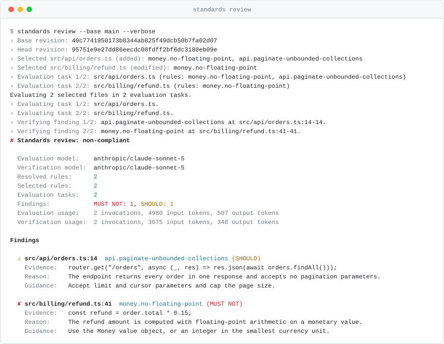

<p align="center">
  <picture>
    <source media="(prefers-color-scheme: dark)" srcset="assets/standards-wordmark-dark.gif">
    <source media="(prefers-color-scheme: light)" srcset="assets/standards-wordmark-light.gif">
    
  </picture>
</p>

<p align="center">
  <strong>Write your engineering rules in YAML. An agent enforces them on every pull request.</strong><br>
  Standards catches the judgement calls that no linter can express, and backs every finding with evidence and line numbers.
</p>

<p align="center">
  <a href="LICENSE"></a>
  <a href="https://github.com/getstandards/standards/stargazers"></a>
</p>

<!-- Add a screenshot of the pull request comment here. It is the best demo of what Standards does. -->

## Rules are code

A rule states intent, not a syntax pattern. Each rule has an RFC 2119 level, a rationale, and the globs it applies to. Rules live in `.standards.yml` and change through pull requests, like any other code.

```yaml
version: 1
name: engineering-standards

rules:
  - id: money.no-floating-point
    level: MUST NOT
    description: Monetary values must not use floating-point types.
    rationale: Floating-point rounding can produce incorrect amounts.
    applies_to:
      include:
        - src/**/*.{ts,tsx}
    guidance: Use the Money value object, or an integer in the smallest currency unit.

  - id: api.paginate-unbounded-collections
    level: SHOULD
    description: An endpoint that returns a collection that can grow without bound accepts pagination parameters.
    rationale: Unbounded responses degrade as the data grows, until the endpoint times out.
    applies_to:
      include:
        - src/api/**/*.ts
    guidance: Accept limit and cursor parameters and cap the page size.
```

No linter can check the second rule. An agent can.

## Findings come with evidence

A review of a change that adds an unpaginated endpoint and computes a refund with floating-point arithmetic. `--verbose` shows every step of the pipeline:

<p align="center">
  <picture>
    <source media="(prefers-color-scheme: dark)" srcset="assets/standards-review-dark.svg">
    <source media="(prefers-color-scheme: light)" srcset="assets/standards-review-light.svg">
    
  </picture>
</p>

Deterministic planning selects the files and the rules the model sees. A separate verification pass re-checks every finding before it is reported. The report shows the models used and the exact token cost of the review.

## Quick start

**1. Install the CLI:**

```bash
npm install --global @getstandards/standards
```

**2. Add your rules.** Run `standards init`, then put the rules your team already agrees on in `.standards.yml`.

**3. Review a change locally:**

```bash
standards review
```

**4. Enforce the rules on every pull request:**

```yaml
# .github/workflows/standards.yml
name: Standards
on: [pull_request]

permissions:
  contents: read
  checks: write
  pull-requests: write

concurrency:
  group: standards-${{ github.event.pull_request.number }}
  cancel-in-progress: true

jobs:
  review:
    runs-on: ubuntu-latest
    steps:
      - uses: actions/checkout@v4
        with:
          fetch-depth: 0
      - uses: getstandards/standards@v1
        with:
          anthropic-api-key: ${{ secrets.ANTHROPIC_API_KEY }}
```

The Action runs the same pipeline as the CLI and posts the report as a check run and a pull request comment.

## Why Standards?

Engineering rules live in wikis, RFCs, and one reviewer's head. They surface after the incident, when someone says *we knew about this*. Standards moves them somewhere enforceable:

- **Not a linter.** Linters match patterns. Standards rules state intent — when a technique applies, which trade-off to prefer — and an agent applies them the way a reviewer does.
- **Not a generic AI reviewer.** No borrowed opinions. The agent enforces *your* rules: written by your team, versioned in Git, scoped by globs, reported with evidence you can audit.
- **Shareable.** `extends` pulls rule packs from other repositories, and a lock file pins every revision, so reviews are reproducible.
- **Token-frugal.** Deterministic planning selects what the model sees; the agent only does the work that needs judgement.
- **Your provider, your model.** You choose the provider and the model for each step of the review.

## Documentation

The full specification lives in [`specs/`](specs/):

- [Configuration](specs/configuration.md) — rules, `extends`, and the lock file
- [Review pipeline](specs/review.md) — how a review runs, and how it keeps token use low
- [CLI](specs/cli.md) — `init`, `validate`, `review`, and the other commands
- [GitHub Action](specs/github.md) — check runs, pull request comments, and permissions
- [Suppressions](specs/suppressions.md) — how to waive a finding in code
- [Rule tests](specs/testing.md) — how to test a rule before you enforce it

## License

[MIT](LICENSE)

---

If Standards is useful to you, star the repository. It helps other teams find it.
