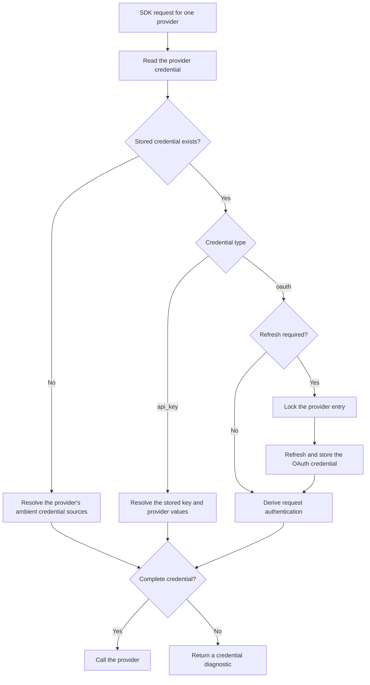
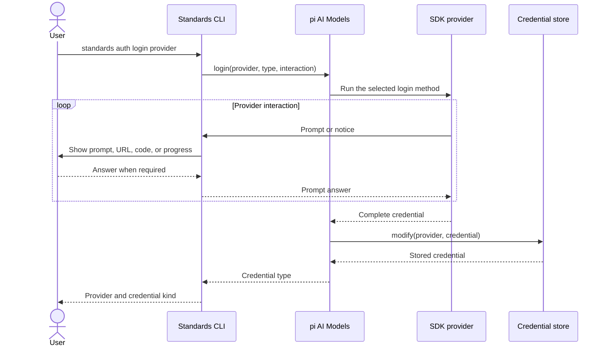

# Standards provider credentials

Defines how Standards stores and resolves model provider credentials through
the pi AI SDK.

## Purpose

The agent steps of [Standards review](./review.md) call a model provider, and
every provider call needs a credential. Users hold credentials in three ways:

- Automation, such as the GitHub Action, holds a provider API key as a
  secret.
- A person runs a review on their own machine with their own provider
  account, which can be a subscription account instead of an API key.
- Some providers use credentials that already exist on the machine, such as
  an AWS profile or Google Application Default Credentials.

This document specifies the credential sources and their precedence, the
`auth login`, `auth logout`, and `auth status` commands, credential storage,
and the rules for automation.

The key words `MUST`, `MUST NOT`, `SHOULD`, `SHOULD NOT`, and `MAY` in this
document are to be interpreted as described by RFC 2119.

## Scope

This document covers only model provider credentials. Git credentials for
configuration sources are outside this document;
[Standards configuration format](./configuration.md) defines their
constraints. Model selection, the provider SDK, and default models are
defined in [Standards review](./review.md).

## Provider SDK integration

The implementation MUST use the pi AI SDK
(`@earendil-works/pi-ai`) for provider authentication. It MUST create one
`Models` collection and give it the Standards credential store. It MUST use
the SDK's `login`, `logout`, `checkAuth`, and request methods. It MUST NOT call
an OAuth implementation directly or create a second credential resolution
path.

The SDK provider ID is the credential key. API billing and subscription
access can use different provider IDs. For example, `openai` uses an OpenAI
API key and `openai-codex` uses a ChatGPT subscription. The implementation
MUST preserve these IDs and MUST NOT merge their credentials.

The implementation MUST get the known providers and their supported login
methods from the registered SDK providers. It MUST NOT keep a separate list
of OAuth providers or authentication methods. This rule lets a pi AI SDK
update add or change a provider without a second Standards registry change.

## Credential resolution

For each provider, the implementation MUST let the SDK resolve a credential
in this priority order:

1. The stored credential that `standards auth login` saved for that provider.
2. The provider's ambient credential sources, such as environment variables,
   credential files, profiles, and workload roles.

A stored credential wins because `auth login` is an explicit user action on
that machine. An environment variable that another tool needs MUST NOT silently
override a subscription account that the user chose to use.

A stored credential owns its provider. If it is invalid, has a type that the
provider does not support, or cannot refresh, resolution MUST fail for that
provider. The implementation MUST NOT fall back to an ambient credential.

A provider has a usable credential when the SDK's `checkAuth` operation
returns a result. Model selection in [Standards review](./review.md) uses this
definition to pick a default provider. A request MUST use an SDK request
method so that the SDK resolves the credential and refreshes OAuth before it
calls the provider.

The principal API key variables are:

| Provider | API key variable |
| --- | --- |
| `anthropic` | `ANTHROPIC_API_KEY` |
| `openai` | `OPENAI_API_KEY` |
| `google` | `GEMINI_API_KEY` |
| Other | The variables and ambient sources that the registered SDK provider defines. |

Some providers need more than one value. For example, Cloudflare needs an
account ID, and Google Vertex can need a project and location. Standards MUST
not reduce a provider credential to one string. It MUST preserve the complete
SDK credential.

The request-time flow is:



## `auth login`

`standards auth login <provider>` stores a credential for one provider:

- When the provider has an OAuth method with `isSubscription` set to `true`,
  the command MUST call `models.login(provider, "oauth", interaction)`.
- Otherwise, when the provider has an interactive API key method, the command
  MUST call `models.login(provider, "api_key", interaction)`.
- Otherwise, when OAuth is the provider's only interactive method, the
  command MUST call `models.login(provider, "oauth", interaction)`.
- When the provider has no interactive method, the command MUST print a
  diagnostic that names its ambient credential sources and exit with status
  `1`.

The `interaction` adapter MUST support all SDK prompt types: `text`, `secret`,
`select`, and `manual_code`. It MUST support all SDK notices: `info`,
`auth_url`, `device_code`, and `progress`. A `secret` or `manual_code` prompt
MUST NOT echo its value. The command MUST show authentication URLs, device
codes, instructions, and safe progress text that the provider sends through
the adapter.

The SDK owns the provider-specific OAuth work. This work can include a local
callback server, a device code, a manual code, or a selection between flow
types. Standards MUST NOT assume one OAuth flow shape. An interrupt MUST
cancel the SDK login operation. A failed or cancelled login MUST NOT replace
the stored credential.

`standards auth login` without a provider, or with an unknown provider, MUST
print a diagnostic that lists the known providers and exit with status `1`. The
command MUST NOT print the stored secret. On success it MUST report the
provider and the credential kind, `oauth` or `api-key`, and exit with status
`0`.

The login flow is:



## `auth logout`

`standards auth logout <provider>` MUST use the credential store metadata to
check the current state. It MUST then call `models.logout(provider)` when a
credential exists. It MUST report the removal. When no credential is stored
for that provider, it MUST report that state. Both cases exit with status
`0`.

An `auth` command MUST NOT modify the configuration, the lock file, or any
other repository file.

## `auth status`

`standards auth status` reports which providers have a usable credential and
where each credential comes from. It MUST read the credential state from two
sources and nothing else:

- The credential store metadata, through `list`, which names the providers
  that `auth login` saved a credential for. `list` MUST NOT resolve or return
  a secret, so the report never holds one.
- The SDK `checkAuth` operation, which decides whether the credential is
  usable and names its source.

A provider that `checkAuth` reports as usable and that the store metadata
names is `stored`; a provider that `checkAuth` reports as usable and that the
metadata does not name holds an ambient credential and is `environment`. A
provider that `checkAuth` reports as unusable has no usable credential, even
when a credential is stored for it: a stored credential owns its provider and
MUST NOT fall back to an ambient one.

The command MUST NOT run a login flow, refresh an OAuth token, or write a
credential. The output MUST NOT contain a credential. Its output and exit
statuses are defined in [Standards CLI](./cli.md).

## Credential storage

Stored credentials live in one file:

- `$XDG_CONFIG_HOME/standards/auth.json`, or `$HOME/.config/standards/auth.json`
  when `XDG_CONFIG_HOME` is unset, on macOS, Linux, and other Unix systems.
- `%APPDATA%\standards\auth.json` on Windows.

The file MUST implement the SDK `CredentialStore` contract. It holds one entry
per SDK provider ID. Each entry uses the SDK credential shape:

```json
{
  "anthropic": {
    "type": "oauth",
    "access": "<secret>",
    "refresh": "<secret>",
    "expires": 0
  },
  "openai": {
    "type": "api_key",
    "key": "<secret>"
  },
  "google-vertex": {
    "type": "api_key",
    "env": {
      "GOOGLE_CLOUD_PROJECT": "example-project",
      "GOOGLE_CLOUD_LOCATION": "europe-west1"
    }
  }
}
```

The on-disk type values are `oauth` and `api_key`. User-facing output uses
`oauth` and `api-key`. An OAuth entry MUST contain `access`, `refresh`, and
`expires`. It MAY contain more provider-owned fields. The credential store
MUST preserve these fields when it reads, refreshes, and writes an entry. An
API key entry MAY contain `key`, `env`, or both. Each `env` value MUST be a
string.

The credential store MUST implement `read`, `list`, `modify`, and `delete`.
`list` MUST return only the provider ID and credential type. It MUST NOT
resolve or return secret values. `modify` MUST be the only write path. It MUST
run a serialized read-modify-write operation. `modify` and `delete` MUST use
a file lock that works across Standards processes which share the file. This
lock prevents concurrent requests from refreshing the same rotating token
twice.

On Unix systems, the implementation MUST create the parent directory with
mode `0700` and the file with mode `0600`. It MUST keep these permissions on
later writes. The file MUST NOT live in a repository, in the source cache, or
in any path that a Standards command writes for another purpose.

An invalid JSON document or invalid credential entry MUST produce a
diagnostic. The implementation MUST NOT replace an invalid file with an empty
file. A missing file is an empty credential store.

## Automation

Automation MUST use an API key through the environment. The GitHub Action
supplies provider API keys as action inputs and forwards them to the review
process as the environment variables above; the inputs are defined in
[Standards GitHub Action](./github.md).

The GitHub Action MUST give the SDK an empty in-memory credential store. It
MUST also give the SDK an authentication context that exposes only the API key
variables which the Action accepts: the principal variables above and the
variables the workflow names in the `provider-env` input, as defined in
[Standards GitHub Action](./github.md). Its `fileExists` operation MUST return
`false`. This rule prevents a self-hosted runner from using a stored OAuth
credential, an AWS profile, Google Application Default Credentials, or an
unrelated provider variable. An OAuth credential belongs to a person's
interactive session and MUST NOT be copied into automation.

## Security considerations

- Credentials MUST NOT be stored in the configuration, the lock file, or the
  source cache. [Standards configuration format](./configuration.md) and
  [Standards source cache](./cache.md) state the same constraints for their
  files.
- Diagnostics, progress output, and the report MUST NOT contain a credential.
- The credential file trusts the file system that holds it. It MUST NOT be
  committed, synced to a lower-trust context, or shared between users.

## Version 1 exclusions

This version does not define:

- Operating system keychain storage for credentials.
- A shared or remote credential service.
- An option that passes an API key on the command line. A command line
  argument leaks through shell history and process lists.
